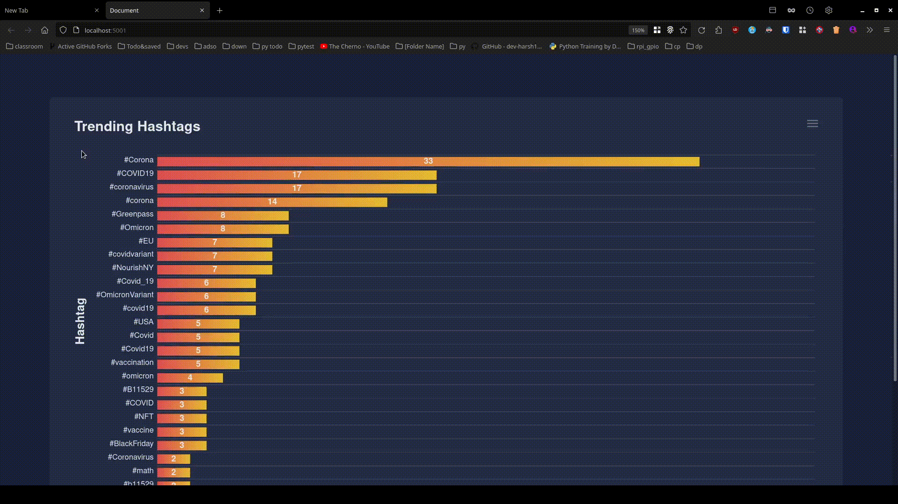

<h1 align="center">
  <b><center>Real Time Twitter based Encyclopedia<br></b></center>
</h1>

<p align="center">


</p>

---

This project will fetch recent tweets based on “keywords” using Twitter API v2, filter "English" hashtags from those tweets and give them
to Apache Spark streaming for processing. We create a file with hashtags and all the tweets it was used in, this acts as input for 
jaccard similarity index using k-means clustering.
After that it will launch a flask web server on localhost:5001
to view the data in a visual dashboard powered by ApexCharts.<br>
*Data contains hashtags and their corresponding descriptions which acts as real time definitions.*
--- 

### Introduction

We are Using Apache Spark streaming, Real-Time Analytics engine, to process tweets retrieved from Twitter API and identify the trending hashtags
from them based on a certain keywords and, finally, represent the data in a real-time dashboard using flask web framework.

### Limitations

- 450 queries per 15 minutes (enforced by twitter APIv2)
  . [see here](https://developer.twitter.com/en/docs/twitter-api/tweets/search/api-reference/get-tweets-search-recent)
- 500K queries per month(enforced by twitter APIv2)
  . [see here](https://developer.twitter.com/en/docs/twitter-api/rate-limits)
- We cannot get general tweets from Twitter. We have to get tweets based on some keywords (enforced by twitter APIv2)

### Getting API keys from twitter.

The dataset used for this project is Twitter tweets. So, to get the Twitter tweets, we need access to Twitter API.

- Go to the [developer portal dashboard](https://developer.twitter.com/en/portal/dashboard)
- Sign in with your developer account
- Create a new project, give it a name, a use-case based on the goal you want to achieve, and a description.
- choose ‘create a new App instead’ and give your App a name in order to create a new App
- If everything is successful, you should be able to see page containing your keys and tokens, we will use Bearer token
  to access the API.
- Make a new file ```keys.txt``` and in it put the bearer token in below format.<br>
  ```token:<your_token_here>```<br>
  Make sure there are no spaces between ```token``` & ```:``` and ```:``` & ```<your_token>```

### Working of the project:


- First, We retrieve tweets from Twitter using
  the [Twitter APIv2](https://developer.twitter.com/en/docs/twitter-api/getting-started/make-your-first-request).
- The tweets are based on keywords that user specifies. (see running the app section)
- The data is processed with the pyspark and hashtags are separated from tweets.
- Hashtags and all their tweets accumulated in a new file to generate description.
- Then we send tweets through a TCP Socket to spark.
- Using Apache spark, we process those trending hashtags.
- To display the data in a visual representation, we are using flask web app.

### Running the Application

First steps...

- Java version should be compatible with pyspark. Current version of pyspark is 3.2.0 and only java version 11 is
  compatible. You can check java version by running command ```java --version```. Make sure to have only compatible java
  version installed.
- ```cd real-time-twitter-based-encyclopedia```
- ```pip install -r ./requirements.txt```

Now...


#### Steps to run the project

Run the Programs in the order. **NOTE: Every step should be run in new terminal** <br>

1. Flask Application ```python3 ./app.py```


2. ```python3 ./twitter_app.py -p _<no_of_pages>_ -k _<"keywords">_```

Replace ```_<"keywords">_``` with the keywords you want to search
(Note that keywords should be in quotes, like ```"worldcup russia recession us climate soccer"```)
and ```<no_of_pages>``` with the number of pages you want for each keyword from twitter.


3. Add these env variables if spark session is not getting created.
  ```
     export PYSPARK_PYTHON=python3
     export SPARK_LOCAL_HOSTNAME=localhost
     python3 ./spark_app.py
   ```
4. Open jaccard_tweet_clustering.ipynb, it takes the input from dict.txt and gives description to top 20 hashtags
### Visual representation

You can access the real-time data in visual representation by accessing this URL given below.

```
http://localhost:5001/ 
```

or

```
http://127.0.0.1/5001
```

### Stopping the application

run ```killall python3```  in new terminal

---

### Jaccard distance metric and K-means clustering algorithm

#### Jaccard Distance

The **Jaccard Similarity Index** is a measure of the similarity between two sets of data.
Developed by Paul Jaccard, the index ranges from 0 to 1. The closer to 1, the more similar the two sets of data.

The Jaccard similarity index is calculated as:

Jaccard Similarity = (number of observations in both sets) / (number in either set)

Or, written in notation form:

```J(A, B) = |A∩B| / |A∪B|```

If two datasets share the exact same members, their Jaccard Similarity Index will be 1. Conversely, if they have no members in common then their similarity will be 0.
<br>Note that we can also use the Jaccard Similarity index for datasets that contain characters as opposed to numbers.

For example, suppose we have the following two sets of data:
```angular2html
   E = ['cat', 'dog', 'hippo', 'monkey']
   F = ['monkey', 'rhino', 'ostrich', 'salmon']
```

To calculate the Jaccard Similarity between them, we first find the total number of observations in both sets, then divide by the total number of observations in either set:

```
Number of observations in both: {‘monkey’} = 1
Number of observations in either: {‘cat’, ‘dog’, hippo’, ‘monkey’, ‘rhino’, ‘ostrich’, ‘salmon’} = 7
Jaccard Similarity: 1 / 7= 0.142857
The Jaccard Similarity Index turns out to be 0.142857. Since this number is fairly low, it indicates that the two sets are quite dissimilar. 
```

**The Jaccard Distance**
<br>The Jaccard distance measures the dissimilarity between two datasets and is calculated as:

```Jaccard distance = 1 – Jaccard Similarity```

This measure gives us an idea of the difference between two datasets or the difference between them.
<br>For example, if two datasets have a Jaccard Similarity of 80% then they would have a Jaccard distance of 1 – 0.8 = 0.2 or 20%.

#### Dataset
Data comes from the real time streaming of twitter data. Data gets stored in the form of a dictionary in text file "dict.txt".
Data is in the format:
```angular2html
    {hashtag1:[tweet1, tweet2, tweet3....], hashtag2:[tweetA, tweetB, tweetC]}
```

#### Tweets Preprocessing
Firstly, the tweets are preprocessed using the following steps:

1. tweet ids and timestamps are removed
2. words that starts with the symbol '@', e.g., @AnnaMedaris, are removed
3. hashtag symbols are removed, e.g., #depression is converted to depression
4. any URL are removed
5. every word is converted to lowercase

#### K-Means Clustering Algorithm
K-means clustering algorithm is implemented from scratch, without using any machine learning libraries.
<br>Jaccard distance is used in place of Euclidian distance to create clusters.
<br>Centroid of the biggest cluster is acts as the` description for corresponding hashtag.

---

### Final Output

Checkout the output video in assets



---

### References
1. https://www.statology.org/jaccard-similarity/
2. https://medium.com/the-researchers-guide/introduction-to-pyspark-a61f7217398e
3. https://medium.com/@tenzin_ngodup/8-basics-commands-for-pyspark-7db425c37a7a
4. https://medium.com/codex/pyspark-setup-on-windows-and-run-your-first-pyspark-program-7ce7c2833338
5. https://medium.com/analytics-vidhya/how-to-setup-pyspark-in-your-mac-2e21f0c8f9b5
6. https://stackoverflow.com/questions/70699255/issue-running-pyspark-on-mac


---

